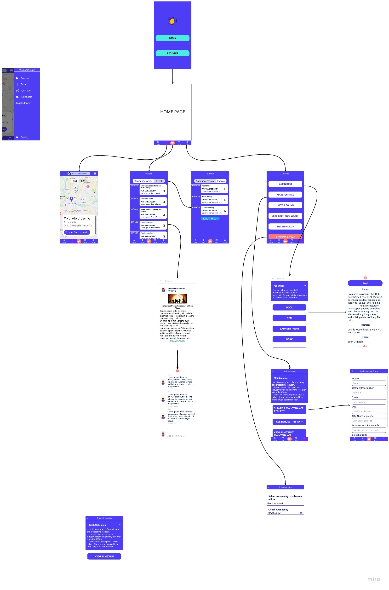

### Hi there 👋

<!--
**jackilex/jackilex** is a ✨ _special_ ✨ repository because its `README.md` (this file) appears on your GitHub profile.

Here are some ideas to get you started:

- 🔭 I’m currently working on ...
- 🌱 I’m currently learning Redux, React Native, Next Js
- 👯 I’m looking to collaborate on ...
- 🤔 I’m looking for help with ...
- 💬 Ask me about ...
- 📫 How to reach me: ...
- 😄 Pronouns: ...
- ⚡ Fun fact: ...
-->

### About Me
 am a Full Stack Software Engineer and a US Marine Corps Veteran with a background in Construction Management. I have knowledge and skills in both Front End and Back End web development. I am Passionate about creating web applications to solve business challenges and streamline redundant processes.
I can handle building a Full Stack project with information and technology gathering, planning, design, development, database creation testing and deployment. My programming languages are Javascript, Typescript, Dart and Python

<!-- ### 🔭  On Going project  🔭 - (check it out) 🔭  -->
<!-- [Property management App](https://github.com/jackilex/Property_managment_communication_App) -->

<!-- ### SKILLS & TECHNOLOGIES
#### Full-Stack Web Development languages:
- Front End Languages: HTML5, CSS, JavaScript ES6+
- Frameworks: Bootstrap, jQuery, ReactJS.
- Back End Languages: JavaScript ES6+, OOP
- Databases: MySQL, MongoDB, GitHub
- Server Side: Node.js, Express, RESTful APIs
- Tools: Git, Visual Studio, npm, Figma, Google map API, socket.io, Handlebars, Jest, SuperTest.
- Test: Unit Testing: functions algorithm , Integration Test: Routes & Middleware, Test Driven Development

[Portfolio](https://jackilex.github.io/portfolio_Alex/#/about)
[Linkedin](https://www.linkedin.com/in/alex-saint-victor)

### WHAT I AM WORKING:
#### MICRO SERVICE BACKEND WITH GRAPHQL
- I am currently contracted to help build a micro-service backend for a start up

#### A communication service for Prorperty managers
- I am also building a communication service that will facilitate communication for property managers and their residents
<!-- 🌱 I’m currently learning .
- GraphQL
- Typescript
- Micro-service design

🌱 I’m currently wokring on app and website which will focus to aid enforcing communications for property managers and their clients. (FYI: this repo is set to private, if you are a recruiter that would like to see my progress; please contact me for access)

This project will require both a website and an app

### APP (IOS + Android)
### STAGE 1: Design -
#### Technology - Figma
During this stage i will focus on implementing the visual aspect of the app

### STAGE 2: Front-end 
#### Technology - React Native (Expo framework)
In this stage i will focus on creating components first, screens second, navigation (tab and stack navigation) and lastly the forms

### STAGE 3: Back-end implementation and testing 
#### Technology - Node.js,GRaphQL + Express, Jest
1) Design Database (Data Modeling)
2) Use Test driven development to set up my HTTP request and also using Postman

### Website (React.js)
### STAGE 4: Website Front-end implementation and SEO
#### Technology - React.js
On this stage i will focus on the website design creating all components and pages for the website. At this stage the backend will have already been complete

### STAGE 5: Testing

### Design and Architecture

### Design (preliminry design, current rect native stage)

### Architecture
The app will focus on a Micro-service architecture

### Stage 1

 -->

